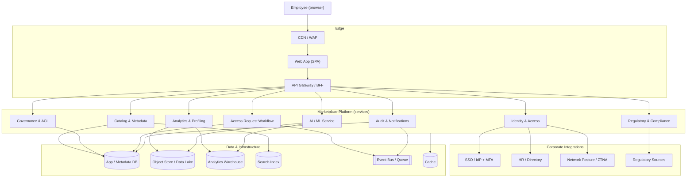

# CLR Data Marketplace — High-Level Architecture & Key Features

This document describes the **target full solution** for an internal, governed data
marketplace for a bank, and maps the current proof-of-concept onto it. It is written as a
blueprint for a production system; the PoC in this repository implements a vertical slice of
it with mocked services.

---

## 1. Vision

A single internal web platform where **every employee is both a data provider and a data
consumer**, and where **all access to data is explicitly governed**. The marketplace is free
of charge (no billing), but “free” means *no cost*, not *open* — every dataset passes through
governance, and a user can only see data their **department or role** is permitted to view.

Goals:
- **Discoverability** — one catalog for all internal datasets, searchable and well-described.
- **Governed access** — governance defines, per dataset, who may view it and on what basis.
- **Speed to insight** — analytics, visualizations and baseline AI are generated automatically.
- **Compliance by design** — regulatory checks (SAMA / PDPL and other regions) are first-class.
- **Auditability & security** — every access decision and data view is logged.

---

## 2. Key Features

### Identity & access
- **SSO login** (corporate IdP) with **MFA / 2-factor** step.
- **Role + department resolution** from the corporate directory (Work ID → roles, department,
  manager, clearance).
- **Network-posture awareness** — warn/limit when a user is off the corporate network.

### Marketplace & discovery
- **Searchable catalog** with filters (department, sensitivity, tags, owner).
- **Rich dataset pages** — description, owning department, sensitivity, steward, lineage.
- **View-only data** — preview without export by default; export is a separate governed right.

### Publishing (provider)
- **Self-service publishing** — upload or connect a source, declare metadata
  (name, description, owning department, sensitivity, steward, tags, schema).
- **Automatic profiling** — schema inference, quality stats, and visualizations on ingest.

### Governance (the core)
- **Per-dataset governance checklist** (classification, regulatory review, access defined,
  approved-for-view) that must be completed before publication.
- **Group-based access control** — governance selects which **departments / roles** may view
  each dataset (no per-person list to maintain).
- **One-step access requests** — out-of-group users request access; governance approves,
  granting the requester’s department/role.
- **Governance console** — review queue, access management, and audit of decisions.

### Analytics & AI
- **Automatic analytics** — descriptive stats, distributions, trends, segments on every dataset.
- **Inline (lightweight) AI** — clustering, regression, anomaly detection run automatically.
- **Heavy/large models on request** — GPU/LLM-class workloads are requested and approved by
  the **Data Department**, then provisioned on the dataset.

### Regulatory & compliance
- **Region-configurable compliance engine** — pass/flag controls per dataset.
  Default profile **Saudi Arabia (SAMA / PDPL)**; pluggable profiles (GDPR, GLBA/CCPA…).
- **Findings surfaced** on the dataset and in a dedicated module.

### Security & assurance
- **RBAC + ABAC** enforced on every view and action.
- **Access checks before any data is shown** (analytics/preview/AI hidden without access).
- **Full audit log** of sign-ins, approvals, access grants, and data views.
- **Admin console** — user directory, network flags, audit, configuration.

---

## 3. High-Level Architecture

### 3.1 System context



### 3.2 Layers

| Layer | Responsibility | Representative tech (target) |
|------|----------------|------------------------------|
| **Client** | SPA: marketplace, dataset pages, governance/admin consoles, role-based UI | React + TypeScript, Vite, Tailwind, Recharts |
| **Edge / BFF** | TLS, WAF, auth token validation, request shaping, rate limiting | CDN + API Gateway, Backend-for-Frontend |
| **Services** | Domain logic split by bounded context (below) | Node/TypeScript or JVM microservices; REST/gRPC |
| **Data** | Metadata DB, data lake/object store, analytics warehouse, search, event bus, cache | PostgreSQL, S3-compatible store, Snowflake/BigQuery-class warehouse, OpenSearch, Kafka, Redis |
| **Integrations** | SSO/MFA, HR directory, network posture, regulatory feeds | OIDC/SAML IdP, SCIM, ZTNA, regulatory rule packs |

### 3.3 Core services (bounded contexts)

1. **Identity & Access** — authenticates via corporate SSO + MFA, resolves Work ID → roles,
   department, manager, clearance; evaluates network posture; issues session tokens.
2. **Catalog & Metadata** — datasets, schemas, tags, lineage, ownership; powers search.
3. **Governance & ACL** — the per-dataset governance checklist and the allowed
   departments/roles; the authoritative source for “who may view what.”
4. **Access Request Workflow** — one-step (or configurable multi-step) approval; emits events
   that update ACLs and notify requesters.
5. **Analytics & Profiling** — ingest-time profiling, quality metrics, and visualization data.
6. **AI / ML Service** — inline baseline models (clustering/regression/anomaly) and a job
   runner for heavy/GPU models gated by Data Department approval.
7. **Regulatory & Compliance** — region-pluggable control engine producing pass/flag findings.
8. **Audit & Notifications** — immutable audit trail + user/queue notifications.

### 3.4 Key flows

**Publish → govern → discover**
```
Provider publishes ─▶ Catalog stores metadata ─▶ Profiling + inline AI run
        │                                              │
        └────────────▶ Governance checklist + access ──┘ ─▶ Published to catalog
```

**Request → approve → access**
```
Consumer (out of group) ─▶ Access Request ─▶ Governance approves
        ▲                                         │
        └──── notified ◀── ACL updated (dept/role granted) ◀──┘ ─▶ data + analytics + AI unlocked
```

---

## 4. Domain Model (core entities)

- **User** — Work ID, name, email, roles[], department, manager, clearance, network status.
- **Dataset** — id, name, description, department, sensitivity, owner, **steward**, tags,
  schema, status (PendingGovernance | Published), **allowedDepartments[]**, **allowedRoles[]**,
  governance checklist[], analytics, inline models, sample data, lineage.
- **AccessRequest** — dataset, requester, requester department, reason, status, decided-by.
- **ModelRequest** — dataset, requester, model, status (heavy-model approval).
- **ComplianceReport** — region/profile, per-control pass/flag findings.
- **AuditEntry** — actor, action, target, timestamp.

---

## 5. Access Control Model

Access is **group-based** (ABAC over department + role), not per-person:

```
canView(dataset, user) =
      user is the owner
   OR user has Governance or Admin role
   OR user.department ∈ dataset.allowedDepartments
   OR any(user.roles) ∈ dataset.allowedRoles
```

- **Governance** owns `allowedDepartments` / `allowedRoles` and the governance checklist.
- A **dataset is invisible/ungated** until governance publishes it.
- **No access ⇒ no data**: description and governance metadata are visible, but analytics,
  preview, and AI are hidden until the user’s group is allowed.
- **Defense in depth**: RBAC on routes/actions, ABAC on data, MFA at login, network posture,
  and audit logging on every decision.

---

## 6. Non-Functional Architecture

- **Scalability** — stateless services behind the gateway, horizontal autoscaling; heavy
  analytics/AI offloaded to the warehouse and a job runner; search and cache for read paths.
- **Availability** — multi-AZ deployment, managed datastores, health checks, graceful degradation.
- **Security** — least-privilege IAM, encryption in transit and at rest, secrets manager,
  data residency honored per region (e.g., in-Kingdom for SAMA), tamper-evident audit log.
- **Observability** — centralized logs, metrics, tracing; alerting on access anomalies.
- **Data governance** — lineage, retention policies, classification, and DLP integration.
- **Compliance** — region rule-packs, evidence retention, periodic control re-evaluation.

---

## 7. Deployment (target)

- **Frontend** — static SPA on CDN.
- **Backend** — containerized services on Kubernetes; API gateway/BFF in front.
- **Data** — managed PostgreSQL (metadata), object store/data lake (datasets), warehouse
  (analytics/AI), search cluster, event bus, cache.
- **CI/CD** — build, test, scan, deploy pipelines; infrastructure as code.
- **Environments** — dev / staging / prod with isolated data and config.

---

## 8. PoC ↔ Full Solution Mapping

The repository is a **single-page React + TypeScript app** that implements the full UX and
domain logic with **mocked services and a browser-resident store** standing in for the
backend and database. It demonstrates every flow without external dependencies.

| Concern | Full solution | This PoC |
|--------|----------------|----------|
| Frontend | React SPA on CDN | ✅ same (Vite build) |
| Backend services | Microservices behind a gateway | Simulated in `src/db/store.ts` (one service layer) |
| Database | PostgreSQL + data lake + warehouse | `localStorage`-persisted store (`src/db/store.ts`) |
| Auth / MFA | Corporate SSO + real MFA | Dummy Work ID + mocked 2FA |
| Access control | ABAC service + policy engine | `src/lib/access.ts` (`canView`) |
| Governance/ACL | Governance service | Governance console + store actions |
| Analytics / AI | Profiling jobs + ML platform | Deterministic mock generators (`src/services/mocks.ts`) |
| Compliance | Region rule-packs + evidence | Mocked region-configurable checks (KSA default) |
| Audit | Immutable, exported to SIEM | In-store audit log (Admin console) |
| Network posture | ZTNA integration | Mocked off-network flag + banner |

### From PoC to production (roadmap)
1. Extract the store’s service layer into real APIs (Catalog, Governance, Workflow, …).
2. Replace `localStorage` with PostgreSQL + object store + warehouse.
3. Integrate corporate **SSO/MFA** and **HR directory** (SCIM) for users/roles.
4. Replace mock analytics/AI with a profiling pipeline and an ML job runner.
5. Implement the **compliance rule engine** with real region packs and evidence retention.
6. Wire **network posture** (ZTNA) and ship audit to the corporate **SIEM**.
7. Add observability, CI/CD, IaC, and multi-environment deployment.

---

> All figures, users, analytics, AI results, and compliance findings in the PoC are mocked.
> This document describes the intended production architecture, not the current implementation.
